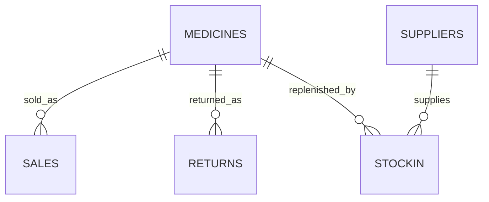

# Pharmacy Operations Analytics Dashboard

An end-to-end healthcare analytics portfolio project built with **SQL Server**, **T-SQL**, **Power Query**, **DAX**, and **Power BI**. The solution converts pharmacy sales, inventory, purchasing, supplier, and return data into operational insights for decision-making.

> **Portfolio disclaimer:** This project uses an educational public dataset and does not contain real patient data. Customer names were transformed into hashed identifiers to demonstrate privacy-conscious analytics. This should not be interpreted as certification of HIPAA compliance.

## Project Overview

Pharmacy managers need reliable answers to four questions:

1. How are sales performing over time and across medicine categories?
2. Which medicines create expiry, overstock, or demand risk?
3. Which suppliers account for the greatest purchasing activity and expenditure?
4. Are product returns financially significant, and can the underlying data be trusted?

The project restores a pharmacy transactional database, validates and repairs key relationships, creates reusable SQL analytical views, builds a Power BI semantic model, and presents the findings across four interactive report pages.

## Dataset

Source: [Pharmacy Management System dataset on Kaggle](https://www.kaggle.com/datasets/hrsobuj/pharmacy-management-system)

| Dataset area | Records |
|---|---:|
| Medicines | 109 |
| Sales rows | 588 |
| Invoices | 474 |
| Stock-in transactions | 138 |
| Suppliers | 146 |
| Return transactions | 8 |

- Sales period: **January 2025–June 2026**
- Purchasing period: **January 2026–June 2026**

## Technology Stack

- **SQL Server / SSMS:** database restoration, data profiling, validation, cleansing, relationship repair, views, and analytical queries
- **T-SQL:** joins, CTEs, conditional logic, aggregation, hashing, validation checks, and inventory classifications
- **Power Query:** field selection, type validation, query naming, and model preparation
- **Power BI:** semantic model, relationships, interactive report design, slicers, conditional formatting, and navigation
- **DAX:** sales, returns, inventory, purchasing, and supplier measures

## Data Model



The Power BI model follows a star-style structure:

- `MedicineInventory` filters Sales, Returns, and Stock Purchases through `MedicineId`.
- `Suppliers` filters Stock Purchases through `SupplierId`.
- `DateTable` filters Sales, Returns, and Stock Purchases through their activity dates.
- Relationships use **one-to-many cardinality** and **single-direction filtering** to prevent ambiguous filter paths.

## Data Preparation and Quality Improvements

The original source contained medicine names in Sales but did not contain a dependable medicine key. Matching by name alone was unsafe because some medicines shared similar or duplicate names with different prices and forms.

The following corrections were completed:

- Added and populated `MedicineId` in Sales.
- Standardized medicine names using trimming and case normalization.
- Resolved ambiguous products using both medicine name and unit price.
- Corrected unmatched `Q-Fol` sales records.
- Corrected one Return record that referenced the wrong `Entacyd` product.
- Validated quantities, prices, negative values, and medicine relationships.
- Added foreign-key relationships after validation.
- Replaced customer names with deterministic SHA-256-based `CustomerKey` values.

### Final validation results

| Validation check | Result |
|---|---:|
| Total sales rows | 588 |
| Sales rows matched to medicines | 588 |
| Unmatched sales rows | 0 |
| Invalid quantity rows | 0 |
| Negative sales rows | 0 |
| Price calculation errors | 0 |
| Unmatched return rows | 0 |

## Analytical SQL Views

| View | Purpose |
|---|---|
| `vw_SalesAnalytics` | Sales, discounts, customer keys, medicine attributes, and net sales |
| `vw_InventoryRisk` | Stock value, expiry status, and inventory exposure |
| `vw_StockPurchases` | Supplier stock-in transactions and purchase value |
| `vw_ReturnAnalytics` | Returns matched to original invoice and medicine sales |
| `vw_InventoryDemand` | Recent demand and estimated days of supply |
| `vw_InventoryActions` | Risk priority and recommended inventory action |
| `vw_SupplierPerformance` | Supplier activity, units received, medicines supplied, and purchase value |

## Dashboard Pages

### 1. Executive Overview

Provides a management-level summary of:

- Net sales after returns
- Total invoices and units sold
- Unique anonymized customers
- Average invoice value
- Monthly net sales trend
- Net sales by medicine category

### 2. Inventory Risk & Action

Helps inventory teams identify:

- Current stock and inventory cost value
- Expired and near-expiry medicines
- Critical and high-risk inventory value
- No-recent-demand and potential-overstock items
- Medicine-level recommended actions

### 3. Suppliers & Purchases

Shows:

- Active and inactive suppliers
- Units received and total purchase value
- Top suppliers by purchase value
- Monthly purchasing trend
- Supplier purchase profile by units, value, and transaction activity

The page is described as purchasing analysis rather than full supplier performance analysis because delivery reliability, lead time, quality, and defect-rate fields are unavailable.

### 4. Returns Monitoring

Tracks:

- Refund value and returned units
- Invoices containing returns
- Invoice and unit return rates
- Average number of days to return
- Refund value by category
- Returned units by medicine
- Return transactions matched to their original sales

## Key DAX Measures

```DAX
Net Sales After Returns =
[Sales After Discounts] - [Refund Amount]
```

```DAX
Invoice Return Rate =
DIVIDE([Invoices With Returns], [Total Invoices], 0)
```

```DAX
Unit Return Rate =
DIVIDE([Units Returned], [Units Sold], 0)
```

```DAX
High Risk Inventory Percentage =
DIVIDE([Critical and High Risk Cost], [Inventory Cost Value], 0)
```

```DAX
Average Days to Return =
AVERAGE(Returns[DaysToReturn])
```

## Key Findings

### Sales and returns

- Gross sales: **$5.11M**
- Discounts: **$79.83K**
- Sales after discounts: **$5.03M**
- Refunds: **$4.75K**
- Net sales after returns: **$5.02M**
- Invoices: **474**
- Units sold: **34,399**
- Returned units: **59**
- Invoice return rate: **1.69%**
- Unit return rate: **0.17%**
- Average time to return: **73.5 days**

Returns are not a major financial risk in this sample, but individual high-value and high-quantity returns should still be monitored.

### Inventory

- Current stock: **9,723 units**
- Inventory cost value: **$1.06M**
- Critical and high-risk inventory: **$881.89K**
- High-risk share of inventory cost: **83.27%**
- Expired medicines in stock: **4**
- Medicines expiring within 90 days: **12**
- Expiry-related inventory cost exposure: approximately **$211.61K**
- No-recent-demand inventory cost: approximately **$837.96K**

The largest operational opportunity is reducing capital tied up in medicines with no recent demand, potential overstock, or near-term expiry.

### Suppliers and purchasing

- Active suppliers: **21**
- Inactive suppliers: **125**
- Units received: **23,131**
- Total purchase value: **$2.32M**
- Most purchasing activity occurred in **January 2026**.
- Purchasing value is concentrated among a small group of suppliers.

## Recommended Business Actions

1. Prioritize critical and high-risk medicines for review, transfer, discounting, or disposal according to pharmacy policy.
2. Pause or reduce purchasing for no-recent-demand and potential-overstock products until demand improves.
3. Monitor near-expiry medicines through a recurring 90-day exception report.
4. Investigate the January purchasing spike and confirm whether it represents planned replenishment, bulk buying, or a source-data issue.
5. Review supplier concentration and establish backup sourcing for medicines dependent on a small number of suppliers.
6. Continue invoice-and-medicine-level validation before approving returns.

## Important Limitations

- The project uses a public educational dataset, not a live pharmacy production system.
- Only eight return records are available, so return patterns should not be generalized.
- Current inventory is a snapshot and cannot reproduce historical inventory balances by month.
- Historical purchase-cost coverage was available for only part of the sales data. Profitability measures were excluded from the final dashboard because they could produce misleading margins.
- Supplier delivery time, quality, fill rate, defects, and contract terms are unavailable; therefore, the project evaluates supplier purchasing activity rather than complete supplier performance.
- Hashed identifiers reduce direct exposure of customer names but do not alone make a system HIPAA compliant.

## Suggested Repository Structure

```text
pharmacy-operations-analytics/
├── README.md
├── data/
│   └── README.md
├── sql/
│   ├── 01_data_profiling.sql
│   ├── 02_data_cleaning.sql
│   ├── 03_data_validation.sql
│   ├── 04_relationships.sql
│   └── 05_analytics_views.sql
├── powerbi/
│   └── Pharmacy_Analytics_Dashboard.pbix
├── screenshots/
│   ├── executive_overview.png
│   ├── inventory_risk.png
│   ├── suppliers_purchases.png
│   └── returns_monitoring.png
└── docs/
    └── data_dictionary.md
```

Do not upload the original backup if its redistribution license is unclear. Instead, provide the Kaggle source link and instructions for restoring the dataset locally.

## Running the Project

1. Download the source dataset from Kaggle.
2. Restore `PharmaDB.bak` in SQL Server Management Studio.
3. Run the SQL scripts in numerical order.
4. Open the Power BI report.
5. Update the SQL Server source under **Data source settings**.
6. Refresh the report and verify the validation totals.

## Dashboard Screenshots
### Executive Overview

### Inventory Risk

### Returns Monitoring

### Suppliers and Purchases


## Author

**Malineni Jaya Sri**  
Data Analyst | SQL | Power BI | Data Validation | Healthcare Analytics

