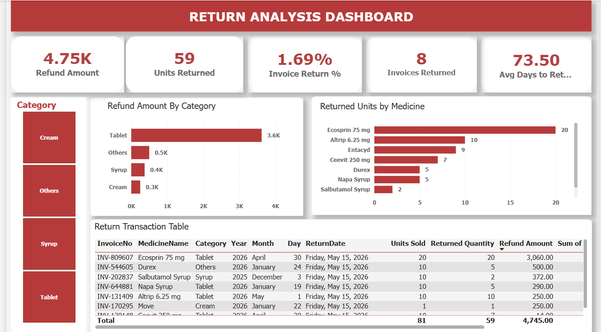

# Pharmacy Operations & Inventory Risk Analysis

An operations-focused Power BI project that evaluates pharmacy inventory risk, purchasing activity, supplier exposure, sales, and returns to support better inventory and procurement decisions.

## Project Overview

The pharmacy held **$1.06M in inventory cost**, but a large share of that value was connected to medicines with limited recent demand, potential overstock, or expiry exposure. The project was designed to help Inventory Operations and Procurement determine where immediate action was required and which purchasing decisions should be reviewed.

The analysis covers **109 medicines, 588 sales records, 138 stock-in transactions, 146 suppliers, 474 invoices, and 8 return transactions**.

## Business Problem

Pharmacy management needs to maintain medicine availability while preventing excess stock, expiry losses, and unnecessary working-capital exposure.

The main business question was:

> **Which medicines require inventory action, and which replenishment decisions should Procurement change over the next 90 days to reduce inventory risk without affecting products with recent demand?**

### Primary stakeholders

- **Inventory Operations:** Identify expired, near-expiry, slow-moving, and potentially overstocked medicines.
- **Procurement:** Determine which replenishment decisions should be paused, reduced, or investigated.
- **Finance:** Monitor working capital tied up in high-risk inventory.
- **Pharmacy Operations:** Protect medicine availability and ensure safe inventory handling.

## Business Questions

### Inventory Operations

- Which medicines are expired or will expire within 90 days?
- How much inventory value is exposed to expiry risk?
- Which medicines have no recent demand?
- Which products show potential overstock?
- What action should be assigned to each high-risk medicine?

### Procurement

- Which medicines should have replenishment paused or reduced?
- Which suppliers account for the largest purchasing exposure?
- Why did purchasing increase sharply in January 2026?
- Are purchasing decisions contributing to slow-moving inventory?

### Finance

- How much working capital is tied up in Critical and High-risk inventory?
- What percentage of total inventory cost is at risk?
- Is inventory exposure materially larger than return-related losses?

### Returns and Data Controls

- What percentage of invoices and units were returned?
- Which medicines generated refunds?
- Are returns correctly connected to the original invoice and medicine?

## Key Performance Indicators

| KPI | Result | Business meaning |
|---|---:|---|
| Total Inventory Cost | **$1.06M** | Total working capital represented by the inventory snapshot |
| Critical and High-Risk Inventory Cost | **$881.89K** | Inventory value requiring management review |
| High-Risk Share of Inventory Cost | **83.27%** | Scale of risk relative to total inventory cost |
| No-Recent-Demand Inventory Cost | **$837.96K** | Capital tied up in medicines without recent demand |
| Expiry-Related Cost Exposure | **$211.61K** | Cost associated with expired or near-expiry medicines |
| Medicines With No Recent Demand | **81** | Products requiring replenishment review |
| Potential-Overstock Medicines | **22** | Products with elevated days-of-supply risk |
| Invoice Return Rate | **1.69%** | Share of invoices associated with a return |
| Unit Return Rate | **0.17%** | Share of sold units that were returned |

## Dashboard

### Executive Overview

Provides a management-level view of sales, inventory, purchasing, suppliers, and returns.

### Inventory Risk and Recommended Actions

Identifies medicines requiring action based on recent demand, expiry status, inventory cost, current stock, and estimated days of supply.

### Suppliers and Purchases

Shows purchasing value, supplier concentration, units received, active supplier status, and monthly purchasing patterns.

### Returns and Data Quality

Monitors return activity and provides transaction-level evidence for validating refunds against the original sale.

## Key Insights

### 1. Inventory risk is the main business priority

- **$881.89K**, or **83.27% of total inventory cost**, was classified as Critical or High risk.
- This exposure is materially larger than the **$4.75K** recorded in refunds.
- Management attention should therefore focus first on inventory and replenishment controls.

### 2. No-recent-demand inventory creates significant working-capital exposure

- **81 medicines** had no recent demand.
- These medicines represented **$837.96K** in inventory cost.
- Replenishing these products without review could increase slow-moving inventory.

### 3. Expiry exposure requires immediate operational action

- **4 medicines** were already expired.
- **12 medicines** were due to expire within 90 days.
- Combined expiry-related cost exposure was **$211.61K**.
- Expired medicines require handling under pharmacy policy, while near-expiry items require FEFO and action review.

### 4. Potential overstock should be reviewed before future purchasing

- **22 medicines** were identified as potential overstock based on demand and estimated days of supply.
- These products should be evaluated at the medicine level before new purchase orders are approved.

### 5. Purchasing was concentrated in January 2026

- Total purchasing value was **$2.32M**.
- January 2026 accounted for the largest monthly purchasing value.
- The available data does not explain whether this was planned bulk replenishment, a one-time event, or a data issue, so Procurement and Finance should investigate it.

### 6. Most registered suppliers were inactive

- Only **21 of 146 suppliers** were active.
- The supplier analysis measures purchasing exposure and activity, not complete supplier performance, because delivery reliability, lead time, quality, and contract data were unavailable.

### 7. Returns were low and should remain a monitoring control

- The dataset contained **8 return transactions**, **59 returned units**, and **$4.75K in refunds**.
- The invoice return rate was **1.69%**, while the unit return rate was **0.17%**.
- Returns were not the largest financial issue in the available data.

## Recommendations

| Priority | Recommended action | Owner | Expected impact | Metric to track |
|---|---|---|---|---|
| **P0** | Quarantine expired medicines and review the 12 medicines expiring within 90 days for FEFO, supplier return, controlled markdown, transfer, or approved disposal. | Pharmacy Operations / Inventory Manager | Address **$211.61K** in expiry-related exposure while protecting patient safety. | Expiry-risk cost, expired units, flagged inventory actioned |
| **P1** | Pause or reduce replenishment for the 81 no-recent-demand medicines and review the 22 potential-overstock medicines before approving new orders. | Procurement / Inventory Manager | Limit additional capital from being committed to slow-moving stock. | No-demand inventory cost, days of supply, purchase quantity |
| **P1** | Assign an owner, action, and target date to every Critical and High-risk medicine. | Pharmacy Operations | Focus management attention on the **$881.89K** high-risk inventory concentration. | At-risk inventory cost, high-risk share, actions completed |
| **P2** | Investigate the January 2026 purchasing spike and document whether it resulted from planned replenishment, bulk purchasing, or a data issue. | Procurement / Finance | Improve purchasing controls and reduce the risk of repeating unnecessary bulk purchases. | Monthly purchase variance and purchase value |
| **P3** | Continue monitoring returns at the invoice and medicine level. | Operations / Data Quality | Maintain transaction control while prioritizing the larger inventory issue. | Refund amount, invoice return rate, unit return rate |

Priority definitions:

- **P0:** Immediate safety or expiry action
- **P1:** High financial and operational priority
- **P2:** Investigation and process improvement
- **P3:** Ongoing monitoring

> The recommendations describe opportunities supported by the data. They do not represent realized savings because post-implementation results are not available.

## Data Quality and Privacy

- All **588 sales rows** were matched to a valid medicine.
- No invalid quantities, negative sales rows, or price-calculation errors remained after validation.
- All return records were matched to the correct medicine and original invoice.
- Ambiguous medicine records were resolved using standardized medicine names and unit prices.
- Customer names were replaced with hashed customer keys in the reporting layer.

The privacy treatment demonstrates de-identification practices but does not, by itself, establish HIPAA compliance.

## Tools Used

- **SQL Server and T-SQL:** Data validation, relationship repair, analytical views, and business-rule calculations
- **Power BI:** Dashboard design, data modeling, filters, navigation, and decision-focused reporting
- **Power Query:** Reporting-layer preparation and data-type validation
- **DAX:** Inventory, purchasing, sales, and return KPIs

## Dataset

Source: [Pharmacy Management System dataset on Kaggle](https://www.kaggle.com/datasets/hrsobuj/pharmacy-management-system)

| Data area | Volume |
|---|---:|
| Medicines | 109 |
| Sales records | 588 |
| Invoices | 474 |
| Stock-in transactions | 138 |
| Suppliers | 146 |
| Return transactions | 8 |

- Sales period: **January 2025–June 2026**
- Purchasing period: **January 2026–June 2026**

## Limitations

- The project uses a public educational dataset rather than a live pharmacy production system.
- Inventory is a current snapshot, so historical monthly inventory balances cannot be reconstructed reliably.
- Only eight returns are available; return patterns should not be generalized.
- Historical purchase-cost coverage was incomplete, so profit and margin were excluded from the final analysis.
- Supplier lead time, fill rate, delivery reliability, product quality, defects, and contract terms were unavailable.
- The dataset does not include multiple pharmacy locations, supplier return eligibility, or post-action results.

## Author

**Malineni Jaya Sri**  
Data Analyst | SQL | Power BI | Operations Analytics | Healthcare Analytics
